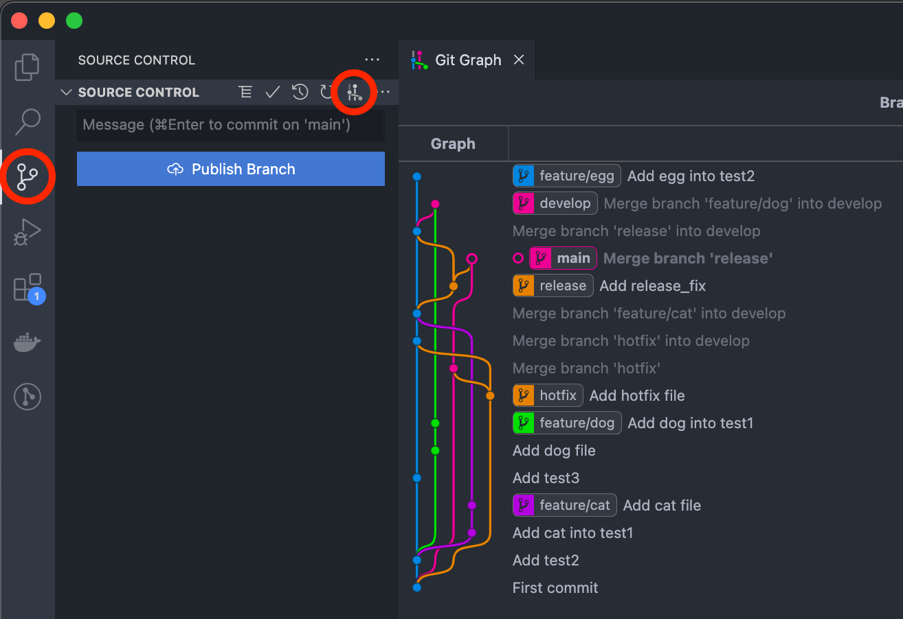

# 環境安裝 (請 mentor 協助)

## [Git](https://git-scm.com/) 安裝

### MacOS

使用 [Homebrew](https://brew.sh/index_zh-tw) 安裝

```bash
$ brew install git
```

## 準備 [GitHub](https://github.com/) 帳號

## VS Code 安裝 (若已安裝可跳過)

- 下載 [VS Code](https://code.visualstudio.com/download) 壓縮檔
- 解壓縮後，將 Visual Studio Code.app 拖拉至 Mac 應用程式中

## Git GUI 介面

安裝 `git graph` 擴充套件

VS Code > 左側 extensions > 搜尋框輸入 ***git graph*** > Install


安裝後即可在 VS Code 左側 Source Control 看到 ***View Git Graph*** 的功能



## 環境設定

安裝完 Git 後，首先需要設定名稱和信箱，在 Terminal 中輸入以下指令

💡 將 ***your.name*** 和 ***your.email@example.com.tw*** 改為自己的名稱和信箱

```bash
$ git config --global user.name "your.name"
$ git config --global user.email "your.email@example.com.tw"
```

💡 `$` 是 Shell 提示字元的一部分，代表一般使用者，他不是指令的一部分

設定提交 Commit 預設編輯器為 **vim**，若想設為自己習慣的編輯器也可

```bash
$ git config --global core.editor vim
```

其他個人化的設定如 alias，可自行斟酌需不需要加入

```bash
$ git config --global alias.br branch
$ git config --global alias.ci commit
$ git config --global alias.st status
$ git config --global alias.lg "log --graph --format=format:'%C(bold blue)%h%C(reset) - %C(bold magenta)(%ar)%C(reset) %C(white)%s%C(reset) %C(dim white)- %an%C(reset)%C(auto)%d%C(reset)' --all"
```

若不想一行一行輸入，也可以直接編輯 git 設定檔

```bash
$ git config --global --edit
```

## 設定 SSH 連線

### 建立 SSH key pair

參考 ****[Generating a new SSH key](https://docs.github.com/en/authentication/connecting-to-github-with-ssh/generating-a-new-ssh-key-and-adding-it-to-the-ssh-agent#generating-a-new-ssh-key)** 建立一對公鑰、私鑰，輸入底下指令

```bash
$ ssh-keygen -t ed25519 -C "*your_email@example.com*"
```

將會得到

```bash
Generating public/private ed25519 key pair.
Enter file in which to save the key (/Users/username/.ssh/id_ed25519):
Enter passphrase (empty for no passphrase):
Enter same passphrase again:
Your identification has been saved in /Users/username/.ssh/id_ed25519.
Your public key has been saved in /Users/username/.ssh/id_ed25519.pub.
The key fingerprint is:
SHA256:xxxxxxx/xxxxxxxxx/xxxxxxxxxx *your_email@example.com*
```

### 設定 GitHub SSH 連線

輸入以下指令，複製公鑰內容

💡 ***/Users/username*** 會根據環境、使用者有所不同，根據自己的環境進行修改

```bash
$ pbcopy < /Users/username/.ssh/id_ed25519.pub
```

至 [GitHub](https://github.com/) 右上角 > Settings > SSH and GPG keys > New SSH key

- Title：為顯示在 GitHub 上這把 key 的名稱，填入自己看得懂的名稱
- Key：將公鑰的內容貼進裡面

### 測試 SSH 連線

```bash
$ ssh -T git@github.com
```

第一次輸入會看到這個，填入 `yes`

```bash
> The authenticity of host 'github.com (IP ADDRESS)' can't be established.
> RSA key fingerprint is SHA256:nThbg6kXUpJWGl7E1IGOCspRomTxdCARLviKw6E5SY8.
> Are you sure you want to continue connecting (yes/no)?
```

你將會得到以下訊息，表示連線成功

```bash
Hi username! You've successfully authenticated, but GitHub does not provide shell access.
```

## 課前需求

在學習使用 Git 前需要先熟悉一下這些內容，以免自己跟不上進度

- Terminal 指令
- 編輯器
    - Vim
    - VS Code
